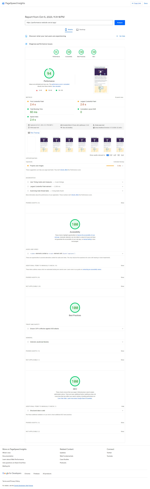

# Performance Website <!-- omit in toc -->

Example of a SEO friendly, performance focused website built getting data from a GraphQL query.


[](https://opensource.org/licenses/MIT)

<p align="center" >
    
</p>

## Summary <!-- omit in toc -->

- [Technologies Used](#technologies-used)
- [Reports](#reports)
  - [Mobile](#mobile)
  - [Desktop](#desktop)
- [Architecture and Directories](#architecture-and-directories)
- [Local Configuration](#local-configuration)
- [Possible Improvements](#possible-improvements)
- [Authors](#authors)
- [License](#license)

## Technologies Used

- [HTML](https://developer.mozilla.org/en-US/docs/Web/HTML) & [CSS](https://developer.mozilla.org/en-US/docs/Web/CSS)
- [Typescript](https://www.typescriptlang.org/)
- [React](https://react.dev/)
- [Next.js](https://nextjs.org/) for SSR
- [NPM](https://www.npmjs.com/)
- [Github Actions](https://docs.github.com/en/actions) for CI/CD


## Reports

### Mobile

<p align="center" >
    
</p>

### Desktop

<p align="center" >
    
</p>

## Architecture and Directories

This section provides an in-depth overview of the structural design and organization of this codebase. It outlines the directories that make up the app's architecture, helping developers understand how the project is structured.

```
Project
├── .github
│   ├── workflows: Github Actions workflows
├── public: Public HTML, images, and other assets that are served as-is by the web server
├── src
│   ├── components: React components used throughout the website
│   ├── graphql: GraphQL-related code, such as queries, mutations, or schema definitions
│   ├── lib: Functions or code that is used across different parts of the website
│   ├── pages: Contains all pages of the app, with each file representing a route
│   ├── styles: Store CSS or stylesheets
|── .eslintrc.json: ESLint project configuration.
|── .gitignore: Specifies files to Git ignore
├── package.json: File that manages all the dependecies and contains script definitions.
|── next.config.ts: Next configuration.
|── tsconfig.json: TS configuration.
```

## Local Configuration

After cloning the project, enter in the project root and run the following command:

```sh
$ npm run setup
```

- By default the application will be started at port 3000.

## Possible Improvements

A system is never perfect and there is always room for improvement. Here are some points that I would like to enhance if I had more time:

- Improve mobile performance

## Authors

|  |
| :----------------------------------------------------------------------------: |
|               [Phillipe Martins](https://github.com/inkasadev/)                |

See also the list of
[contributors](https://github.com/inkasadev/react-chat/contributors) who
participated in this project.

## License

This project is licensed under the MIT License - see the
[LICENSE.md](LICENSE.md) file for details

